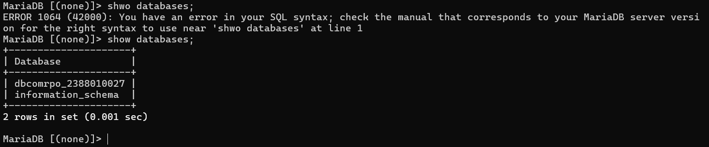

Setting-up Database di AWS Ec2 menggunakan MariaDb

1. Aktifkan Instance AWs Ec2
2. Remote Instance Via Open SSH Powershell / putty
3. Patching OS (sudo apt-get update && sudo apt-get upgrade)
4. Install MariaDb (sudo apt install mariadb-server -y)
5. Cek Status MariaDb (systemctl status mariadb) alt text
   

6. Test Default Setting database server login sudo mysql -u root -p alt text
   
7. Hardening Database Server sudo mysql_secure_installation
   Change the password for the root user = Y
   Remove anonymous users = Y
   Disallow root login remotely = Y
   Remove test database and access to it = Y
   Reload privilege tables = Y
   

8. Create DB untuk Website Company Profile
   Login sebagai root

Create DB nama dbcompro_NIM => CREATE DATABASE dbcompro_NIM; alt text

Create User dengan nama = usrcompro_NIM dan password = [PASSWORD] => CREATE USER 'usrcompro_NIM'@'localhost' IDENTIFIED BY '[PASSWORD]';

Grant user akses ke DB yang baru dibuat => GRANT ALL PRIVILEGES ON dbcompro_NIM.\* TO 'usrcompro_NIM'@'localhost';

Flush privileges => FLUSH PRIVILEGES;

exit;

login sebagai usrcompro_NIM dan cek apakah bisa akses ke DB yang baru dibuat

<<<<<<< HEAD:adm_server_6A/Pertemuan_5/Mariadnb.md

> > > > > > > e0aa88f8e358ddbe0e8097ebf357a05ca3f7dcfe:Pertemuan_5/Mariadnb.md
