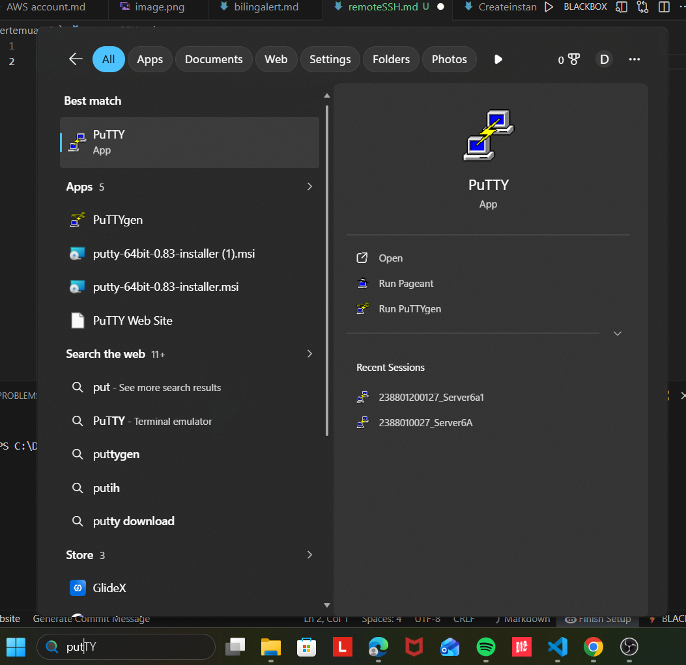

1. unduh dan Install Putty di https://www.chiark.greenend.org.uk/~sgtatham/putty/latest.html
   
2. Konversi ekstensi Private Key dari .pem menjadi .ppk

Buka Putty Gen
Load Private Key .pem
Klik Save Private Key menjadi ekstensi File .ppk

 3. Setting-Up Remote SSH dengan Putty

isi Ipv4 addres Public data berasal dari instance masing2
port SSH (22)
load private key .ppk di menu Connection->SSH->Auth->Credential
user dari instance masing-masing (ubuntu)
 4. Setiap awal Remote kita lakukan Patching OS
sudo apt-get update && sudo apt-get upgrade

5. coba lakukan instalasi Web Server dalam keadaan Kosong
   
   instal salah satu web server sudo apt install nginx

karena ada kendala yg mengharuskan mematikan servernya jadi ip di ss an ini berbeda dengan ip di ss sebelumnya
